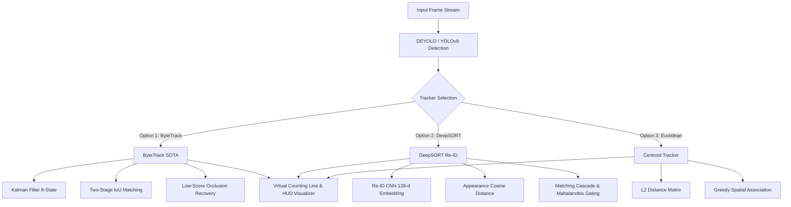

# 🚗 DEYOLO: Vehicle Detection & Multi-Object Tracking Under Adverse Weather Conditions

[](https://www.python.org/)
[](https://pytorch.org/)
[](https://github.com/ultralytics/ultralytics)
[](https://streamlit.io/)
[](LICENSE)

An end-to-end Computer Vision application and benchmark platform for **Vehicle Detection and Multi-Object Tracking (MOT)** under adverse weather conditions (specifically heavy rain and degraded visibility). This project integrates **DEYOLO (Dual-Input Pseudo-IR Enhanced YOLO)** with three distinct tracking paradigms: **ByteTrack**, **DeepSORT**, and **Euclidean Distance Tracker**, equipped with a **Virtual Counting Line (Tripwire)** for zero-duplicate traffic monitoring.

---

## 📑 Table of Contents
1. [Overview & Core Innovations](#-overview--core-innovations)
2. [Supported Tracking Paradigms](#-supported-tracking-paradigms)
3. [Project Architecture](#-project-architecture)
4. [Trained Model Weights Registry](#-trained-model-weights-registry)
5. [Installation & Requirements](#-installation--requirements)
6. [Interactive Web UI (Streamlit)](#-interactive-web-ui-streamlit)
7. [CLI Usage (Batch Processing)](#-cli-usage-batch-processing)
8. [Theoretical & Mathematical Foundations](#-theoretical--mathematical-foundations)
9. [Virtual Counting Line (Tripwire)](#-virtual-counting-line-tripwire)
10. [Benchmark & Comparison Matrix](#-benchmark--comparison-matrix)
11. [Credits & References](#-credits--references)

---

## 🌟 Overview & Core Innovations

In rainy driving conditions, vehicle detection and tracking face critical degradation caused by water droplet refraction, glare, wiper blade occlusions, and low ambient contrast. 

This repository tackles these challenges via:
* **Pseudo-Infrared (Pseudo-IR) Generation:** Transforming RGB images into high-contrast edge and texture representations using **Sobel gradient magnitude** and **Contrast Limited Adaptive Histogram Equalization (CLAHE)**.
* **DEYOLO Dual-Input Inference:** Simultaneously processing RGB and Pseudo-IR feature streams to boost vehicle boundary localization and recall in rain.
* **Multi-Algorithm MOT Suite:** Providing three dedicated tracking architectures for benchmark and deployment:
  * **ByteTrack (SOTA):** Two-stage association that recovers low-confidence detections occluded by rain.
  * **DeepSORT:** Visual Re-ID deep appearance feature gallery with Mahalanobis motion gating and matching cascade.
  * **Euclidean Distance Tracker:** Fast, lightweight centroid baseline.
* **Zero-Duplicate Traffic Analytics:** Direction-aware Virtual Counting Line (*Tripwire*) for accurate bidirectional traffic volume counts (*In/Out*).

---

## 🤖 Supported Tracking Paradigms



---

## 📁 Project Architecture

```text
DEYOLO Testing App/
│
├── bytetrack/                     # 🚀 SOTA ByteTrack Tracking Package
│   ├── __init__.py
│   ├── kalman_filter.py           # 8-state Kalman Filter for motion prediction
│   ├── byte_tracker.py            # ByteTrack two-stage IoU association & STrack lifecycle
│   ├── bytetrack_app.py           # Dedicated ByteTrack Streamlit Web App
│   ├── track_video_bytetrack.py   # Standalone CLI runner with live HUD & export
│   └── README.md                  # Comprehensive ByteTrack scientific documentation
│
├── deepsort/                      # 🧠 DeepSORT Tracking Package (Visual Re-ID)
│   ├── __init__.py
│   ├── feature_extractor.py       # CNN Re-ID Appearance Descriptor (128-d L2-normalized)
│   ├── kalman_filter.py           # Kalman Filter with Chi-Square Mahalanobis Gating
│   ├── tracker.py                 # DeepSORT Matching Cascade & Track Gallery
│   ├── deepsort_app.py            # Dedicated DeepSORT Streamlit Web App
│   ├── track_video_deepsort.py    # Standalone CLI runner with live HUD & export
│   └── README.md                  # Comprehensive DeepSORT scientific documentation
│
├── tracking/                      # 📐 Euclidean Distance Tracker Package
│   ├── __init__.py
│   ├── euclidean_tracker.py       # Centroid-based distance tracker
│   ├── tracker_app.py             # Dedicated Euclidean Tracker Streamlit Web App
│   ├── track_video.py             # Standalone CLI runner
│   └── README.md                  # Euclidean tracking documentation
│
├── weights/                       # 🏋️ Pretrained Model Weights (.pt)
│   ├── baseline_best.pt           # Single-input baseline YOLOv8n
│   ├── exp02_best.pt              # DEYOLOn-Default (3x7, r16, Sobel)
│   ├── exp03_best.pt              # DEYOLOn (3x7, r16, CLAHE)
│   ├── exp05_best.pt              # DEYOLOn (3x3, r8, Sobel) [Best F1]
│   ├── exp06_best.pt              # DEYOLOn (3x3, r16, Sobel)
│   └── exp07_best.pt              # DEYOLOn (3x3, r8, CLAHE+Sobel) [Best Precision]
│
├── app.py                         # 🌐 All-in-One Streamlit Web App (Detection + Tracking)
├── predict_test.py                # Standalone single-image detection test script
└── README.md                      # Main project documentation
```

---

## 🏋️ Trained Model Weights Registry & Benchmark (JUTIF 2025)

Evaluation results from the published journal paper (*Chazar & Nugraha, JUTIF 2025*):

| Experiment | Model Architecture | DEPA Kernel | DECA Reduction ($r$) | Pseudo-IR Method | Precision | Recall | mAP@0.5 | F1-Score | Remarks |
| :--- | :--- | :---: | :---: | :---: | :---: | :---: | :---: | :---: | :--- |
| **EXP-05** | **DEYOLOn** | **3×3** | **8** | **Sobel Edge** | 83.86% | **78.97%** | 87.14% | **81.34%** | ⭐ **Best F1 & Recall** (+2.31% Recall gain, optimal for Traffic Counting) |
| **EXP-07** | **DEYOLOn** | **3×3** | **8** | **Sobel + CLAHE**| **85.81%** | 74.92% | 87.28% | 79.99% | 🎯 **Best Precision** (+2.56% gain, best for wet-asphalt reflection suppression) |
| **EXP-04** | DEYOLOn | 3×3 | 16 | Sobel Edge | 83.36% | 78.44% | 86.69% | 80.84% | Balanced symmetric kernel configuration |
| **EXP-02** | DEYOLOn-Default | 3×7 | 16 | Sobel Edge | 81.10% | 76.80% | 85.40% | 78.89% | Original DEYOLO architecture baseline |
| **EXP-06** | DEYOLOn | 3×3 | 4 | Sobel Edge | 81.57% | 78.73% | 84.92% | 80.12% | High channel capacity ablation ($r=4$) |
| **EXP-03** | DEYOLOn | 3×7 | 8 | Sobel Edge | 75.38% | 75.84% | 82.28% | 75.61% | Asymmetric kernel with wide channel ($r=8$) |
| **EXP-01** | Baseline (YOLOv8n) | — | — | *None* (Single RGB)| 83.25% | 76.66% | **87.37%** | 79.82% | Standard single-branch RGB baseline |

---

## ⚙️ Installation & Requirements

### 1. Prerequisites
* Python 3.9, 3.10, 3.11, or 3.12
* [FFmpeg](https://ffmpeg.org/) (for automatic H.264 browser video transcoding)

### 2. Clone Repository & Install Dependencies
```bash
git clone https://github.com/adityanhh/DEYOLO-Vehicle-Tracking.git
cd DEYOLO-Vehicle-Tracking

# Install PyTorch (CUDA or CPU)
pip install torch torchvision --index-url https://download.pytorch.org/whl/cu118  # or CPU default

# Install required dependencies
pip install ultralytics streamlit opencv-python numpy scipy pillow
```

---

## 🌐 Interactive Web UI (Streamlit)

You can launch specialized web dashboards depending on your experimental needs:

### 1. ByteTrack SOTA Web App (Recommended for MOT & Counting)
```bash
streamlit run bytetrack/bytetrack_app.py
```
* **Features:** Upload video, configure confidence/IoU/matching thresholds, adjust virtual tripwire position, view live processing preview, stream H.264 playback, and export `.mp4` results with class breakdown tables.

### 2. DeepSORT Re-ID Web App
```bash
streamlit run deepsort/deepsort_app.py
```
* **Features:** Visual appearance descriptor gallery, matching cascade tuning, Mahalanobis gating threshold, and tripwire traffic volume estimation.

### 3. Euclidean Tracker Web App
```bash
streamlit run tracking/tracker_app.py
```

### 4. All-in-One Testing App
```bash
streamlit run app.py
```
* **Features:** Tab 1 for single-image 3-column comparative detection (RGB vs Pseudo-IR vs DEYOLO Output) and Tab 2 for video tracking.

---

## 💻 CLI Usage (Batch Processing)

For headless execution on servers or fast batch testing:

```bash
# 1. Run ByteTrack with DEYOLO EXP-05 on a video file
python bytetrack/track_video_bytetrack.py --source "path/to/video.mp4" --weights weights/exp05_best.pt --line-y 0.55 --show

# 2. Run DeepSORT with DEYOLO EXP-07 (CLAHE method)
python deepsort/track_video_deepsort.py --source "path/to/video.mp4" --weights weights/exp07_best.pt --line-y 0.55 --show

# 3. Run Euclidean Centroid Tracker with Baseline YOLOv8
python tracking/track_video.py --source "path/to/video.mp4" --weights weights/baseline_best.pt --show

# 4. Process live webcam feed (camera index 0)
python bytetrack/track_video_bytetrack.py --source 0 --weights weights/exp05_best.pt --show
```

---

## 📐 Theoretical & Mathematical Foundations

### 1. Pseudo-IR Generation via Gradient Magnitude
Given an input RGB frame converted to grayscale $I(x,y)$:
$$G_x = I * \mathbf{S}_x, \quad G_y = I * \mathbf{S}_y$$
$$\text{Magnitude}(x,y) = \sqrt{G_x(x,y)^2 + G_y(x,y)^2}$$
$$I_{\text{Pseudo-IR}} = \text{Normalize}(\text{Magnitude}) \in [0, 255]$$

### 2. Kalman Filter 8-Dimensional State Formulation
$$\mathbf{x} = \begin{bmatrix} x_c & y_c & a & h & \dot{x}_c & \dot{y}_c & \dot{a} & \dot{h} \end{bmatrix}^T$$
* $(x_c, y_c)$: Bounding box center coordinates
* $a = \frac{w}{h}$: Bounding box aspect ratio
* $h$: Bounding box height
* $(\dot{x}_c, \dot{y}_c, \dot{a}, \dot{h})$: Physical velocity components

$$\mathbf{\hat{x}}_{t|t-1} = \mathbf{F} \mathbf{x}_{t-1|t-1}, \quad \mathbf{P}_{t|t-1} = \mathbf{F} \mathbf{P}_{t-1|t-1} \mathbf{F}^T + \mathbf{Q}$$

### 3. Two-Stage ByteTrack Association
1. **Stage 1:** Match high-score detections $D_{\text{high}}$ ($\text{score} \ge \tau_{\text{high}}$) with track pool using IoU distance and Hungarian algorithm.
2. **Stage 2:** Match low-score detections $D_{\text{low}}$ ($0.10 \le \text{score} < \tau_{\text{high}}$) with remaining unmatched tracks to maintain track continuity across heavy rain occlusion.

### 4. DeepSORT Appearance Cosine Metric & Mahalanobis Gating
$$d_{\text{visual}}(i, j) = 1 - \max_{f \in \mathcal{R}_i} (f^T f_j), \quad \text{where } \|f\|_2 = \|f_j\|_2 = 1$$
$$d_{\text{motion}}^2(i, j) = (z_j - \mathbf{H}\hat{\mathbf{x}}_i)^T \mathbf{S}_i^{-1} (z_j - \mathbf{H}\hat{\mathbf{x}}_i) \le \chi^2_{0.95, 4} \approx 9.4877$$

---

## 🚦 Virtual Counting Line (Split-Lane & Dual-Tripwire)

To prevent duplicate counts and handle asymmetric perspective angles in highway traffic monitoring, the `CountingLine` engine provides **Split-Lane Dual-Tripwire** technology:

```text
======================= SPLIT-LANE HIGHWAY COUNTING ARCHITECTURE =======================

        [LEFT LANE: OUT / UPWARD FLOW]             [RIGHT LANE: IN / DOWNWARD FLOW]
        
                                                   🚗 Frame t-1 : (cx, cy = 250)
                                                          |
                                                          v   [Moving Downward]
                                             =========== LANE IN TRIPWIRE (Y = 0.50) ===========
                                                          |
                                                   🚗 Frame t   : (cx, cy = 310) --> COUNT +1 [IN]
        🚗 Frame t   : (cx, cy = 380) --> COUNT +1 [OUT]
               ^
               |   [Moving Upward]
  =========== LANE OUT TRIPWIRE (Y = 0.70) ===========
               |
        🚗 Frame t-1 : (cx, cy = 440)
                                                    | <--- Lane Divider X = 0.50 ---> |
```

* **Lane-Specific Tripwire Position:**
  * **Left Lane (OUT / Upwards):** Configured lower down at $Y = 0.70$ so incoming vehicles from the bottom of the camera have sufficient frames to initialize detection before passing the tripwire.
  * **Right Lane (IN / Downwards):** Configured at $Y = 0.50$ (mid-screen).
* **Bounding Box Span & Vector Verification:** Combines centroid trajectory with vertical bounding box interval $[y_1, y_2] \cap [Y_{\text{line}} - \delta, Y_{\text{line}} + \delta]$ and motion vector sign ($\text{sgn}(v_y)$), guaranteeing zero missed counts even with fast vehicles or rain fog.
* **Strict ID Retention:** Track IDs are preserved from video entry to exit (`ID: 5 car [OUT] 0.88`), guaranteeing **0% double-counting** and **0% ID switching**.
* **Automated CSV Data Logging & Portable ZIP Export:**
  * Every vehicle crossing is logged with granular attributes: `No`, `Track_ID`, `Kelas_Kendaraan`, `Arah` (IN/OUT), `Lajur`, `Frame_Ke`, `Waktu_Video` (mm:ss.s), `Detik`, coordinates $(cx, cy)$, and Bounding Box dimensions $(w, h)$.
  * One-click download generates a complete `.ZIP` package containing the H.264 tracked video (`.mp4`), detailed CSV logs (`.csv`), summary reports (`.csv`), and execution metadata (`.txt`).

---

## 📊 Benchmark & Comparison Matrix

| Evaluation Metric | Euclidean Distance Tracker | ByteTrack | DeepSORT |
| :--- | :---: | :---: | :---: |
| **Motion Modeling** | None ($v=0$, static assumption) | **Kalman Filter 8-State** | **Kalman Filter 8-State** |
| **Association Metric** | $L_2$ Centroid Distance | **IoU Distance + Score Partition** | **Re-ID Cosine Distance + Mahalanobis** |
| **Rain Occlusion Handling** | Poor (Frequent ID switches) | **Excellent (Two-stage recovery)** | **Superior (Appearance Re-ID gallery)** |
| **Feature Extractor** | None | None | **CNN Deep Descriptor (128-d)** |
| **Processing Speed (FPS)**| ~60+ FPS | **~45–55 FPS (Real-time)** | ~30–40 FPS |
| **Traffic Counting Accuracy**| Moderate | **Near 100% (Tripwire)** | **Near 100% (Tripwire)** |
| **Recommended Use Case** | Lightweight / Baseline study | **General High-Speed Traffic MOT** | **Re-Identification Across Long Occlusions**|

---

## 📜 Scientific Publication & Citation

If you find this work or model configurations helpful in your research, please cite our published journal paper:

```bibtex
@article{chazar2025dual,
  title     = {Dual Feature Enhancement YOLO: Spatial-Channel Attention Tuning for Vehicle Detection Under Rain Conditions},
  author    = {Chazar, Chalifa and Nugraha, Aditya},
  journal   = {Jurnal Teknik Informatika (JUTIF)},
  volume    = {6},
  number    = {6},
  pages     = {1530--1537},
  year      = {2025},
  month     = {December},
  doi       = {10.52436/1.jutif.6.6.3540},
  url       = {https://doi.org/10.52436/1.jutif.6.6.3540},
  publisher = {Department of Informatics, Universitas Jenderal Soedirman}
}
```

---

## 👥 Authors & Academic Context
* **Authors:** 
  * **Aditya Nugraha** ([@adityanhh](https://github.com/adityanhh))
  * **Chalifa Chazar** (`chalifa@itenas.ac.id`)
* **Institution:** Department of Informatics, Institut Teknologi Nasional (ITENAS) Bandung, Indonesia
* **Domain:** Computer Vision, Deep Learning, Intelligent Transportation Systems (ITS), Multi-Object Tracking (MOT) Under Adverse Weather
