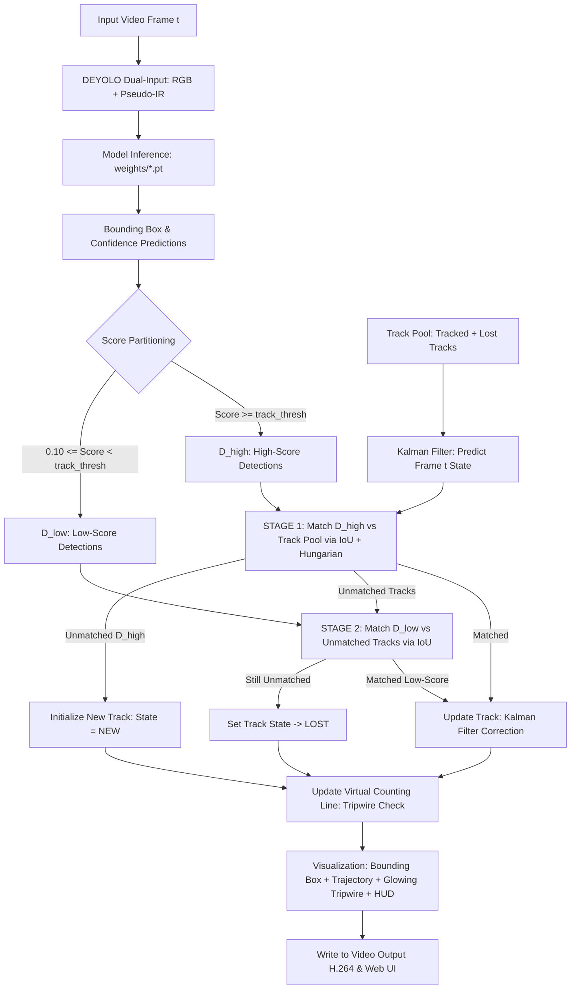
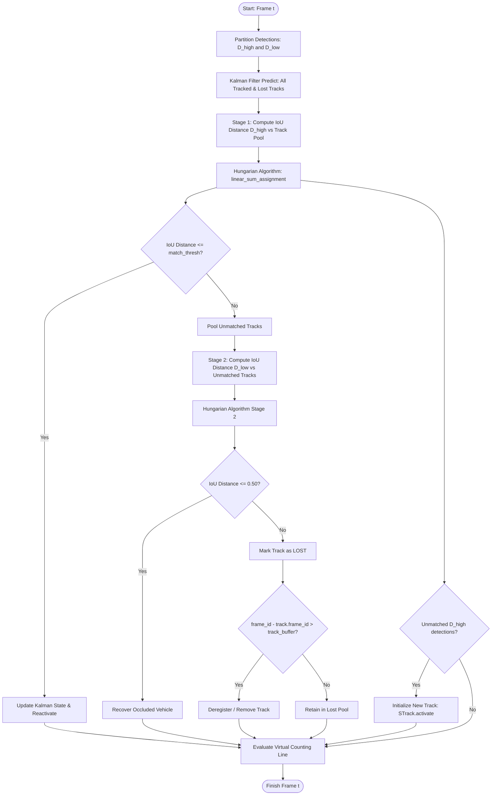

# 🚗 ByteTrack SOTA Multi-Object Tracking & Vehicle Counting (DEYOLO)

This module provides a standalone, dependency-clean implementation of the **ByteTrack** algorithm (*Zhang et al., ECCV 2022*) integrated with **DEYOLO (Dual-Input Pseudo-IR)** and **YOLOv8** for vehicle tracking and counting under adverse rainy weather conditions.

It includes an **8-State Kalman Filter**, **Two-Stage IoU Association**, and a **Virtual Counting Line (Tripwire)** for zero-duplicate traffic counting.

---

## 📑 Table of Contents
1. [Why ByteTrack Resolves ID Switching in Rain](#1-why-bytetrack-resolves-id-switching-in-rain)
2. [ByteTrack Pipeline Architecture](#2-bytetrack-pipeline-architecture)
3. [Two-Stage Association Flowchart](#3-two-stage-association-flowchart)
4. [Mathematical Formulation](#4-mathematical-formulation)
5. [Virtual Counting Line (Tripwire) Mechanism](#5-virtual-counting-line-tripwire-mechanism)
6. [Directory Structure](#6-directory-structure)
7. [Usage Guide (Web UI & CLI)](#7-usage-guide)
8. [Comparison: Euclidean Distance Tracker vs ByteTrack](#8-comparison-euclidean-distance-tracker-vs-bytetrack)

---

## 1. Why ByteTrack Resolves ID Switching in Rain

Conventional trackers discard low-confidence detections ($score < threshold$). In rainy driving conditions (wiper motions, water droplets, road surface glare), vehicle detection confidence scores often dip temporarily. Discarding these detections immediately breaks track trajectories and causes **ID Switching** and **Duplicate Counting**.

**Core ByteTrack Innovation (BYTE Strategy):**
1. **Retaining Low-Score Detections:**
   * Detections are partitioned into $D_{\text{high}}$ ($score \ge 0.45$) and $D_{\text{low}}$ ($0.10 \le score < 0.45$).
2. **Two-Stage Matching:**
   * **Stage 1:** Match $D_{\text{high}}$ with active tracks using IoU distance and Hungarian algorithm.
   * **Stage 2:** For unmatched tracks from Stage 1, match with $D_{\text{low}}$.
   * Occluded vehicles in rain are successfully recovered and mapped to their existing IDs without triggering false new track creations.
3. **Physical Velocity Modeling (Kalman Filter 8-State):**
   * Predicts bounding box center and scale velocity $(v_x, v_y, v_a, v_h)$, allowing high-speed highway vehicles (80–120 km/h) to maintain seamless track continuity.

---

## 2. ByteTrack Pipeline Architecture



---

## 3. Two-Stage Association Flowchart



---

## 4. Mathematical Formulation

### A. Kalman Filter 8-Dimensional State Space
$$\mathbf{x} = \begin{bmatrix} x_c & y_c & a & h & \dot{x}_c & \dot{y}_c & \dot{a} & \dot{h} \end{bmatrix}^T$$
* $(x_c, y_c)$: Centroid coordinates
* $a = \frac{w}{h}$: Aspect ratio
* $h$: Bounding box height
* $(\dot{x}_c, \dot{y}_c, \dot{a}, \dot{h})$: Velocity components

$$\mathbf{\hat{x}}_{t|t-1} = \mathbf{F} \mathbf{x}_{t-1|t-1}, \quad \mathbf{P}_{t|t-1} = \mathbf{F} \mathbf{P}_{t-1|t-1} \mathbf{F}^T + \mathbf{Q}$$
$$\mathbf{K}_t = \mathbf{P}_{t|t-1} \mathbf{H}^T (\mathbf{H} \mathbf{P}_{t|t-1} \mathbf{H}^T + \mathbf{R})^{-1}$$
$$\mathbf{x}_{t|t} = \mathbf{\hat{x}}_{t|t-1} + \mathbf{K}_t (\mathbf{z}_t - \mathbf{H} \mathbf{\hat{x}}_{t|t-1})$$

### B. IoU Distance Cost Matrix
$$\text{Cost}(\text{Track}_i, \text{Det}_j) = 1 - \text{IoU}(\text{Box}_i, \text{Box}_j) = 1 - \frac{\text{Area}(\text{Box}_i \cap \text{Box}_j)}{\text{Area}(\text{Box}_i \cup \text{Box}_j)}$$

---

## 5. Virtual Counting Line (Tripwire) Mechanism

To guarantee **0% duplicate counting**, `CountingLine` monitors trajectory intersection against the virtual reference line $Y = Y_{\text{line}}$:

```text
               🚗 (Frame t-1: Y = 280)
                   |
                   v  [Downward Motion Vector]
================ VIRTUAL COUNTING LINE (Y = 300) ================
                   |
               🚗 (Frame t: Y = 325) -> COUNT +1 [Direction: IN / DOWN]
```

* Crossed track IDs are added to `counted_ids = {1, 4, 7, ...}`, ensuring that even if a vehicle idles or changes shape, it is counted **exactly once**.

---

## 6. Directory Structure

```text
bytetrack/
├── __init__.py               # Package initializer
├── kalman_filter.py           # 8-state Kalman Filter
├── byte_tracker.py            # Core ByteTrack algorithm & CountingLine class
├── bytetrack_app.py           # Dedicated Streamlit Web UI
├── track_video_bytetrack.py   # Standalone CLI runner
└── README.md                  # Scientific documentation
```

---

## 7. Usage Guide

### A. Web UI (Streamlit)
```bash
streamlit run bytetrack/bytetrack_app.py
```
* Upload video file (e.g. 5-minute rain test video).
* Adjust the **Counting Line Y Position** slider to your camera's perspective.
* Click **"🚀 Start ByteTrack Video"**.

### B. Command Line Interface (CLI)
```bash
# Model DEYOLO (Dual-Input Pseudo-IR Sobel) + Counting Line at 55% frame height
python bytetrack/track_video_bytetrack.py --source "video.mp4" --weights weights/exp05_best.pt --line-y 0.55 --show

# Model DEYOLO (CLAHE + Sobel)
python bytetrack/track_video_bytetrack.py --source "video.mp4" --weights weights/exp07_best.pt --line-y 0.55 --show

# Save to custom output path
python bytetrack/track_video_bytetrack.py --source "video.mp4" --weights weights/exp05_best.pt --output bytetrack_results/output.mp4
```

---

## 8. Comparison: Euclidean Distance Tracker vs ByteTrack

| Metric / Capability | Euclidean Distance Tracker | ByteTrack |
| :--- | :---: | :---: |
| **Motion Prediction** | None ($v=0$, static assumption) | **Kalman Filter 8-State** |
| **Association Metric** | $L_2$ Centroid Distance | **IoU Distance + Score Partition** |
| **Association Algorithm** | Greedy Nearest Neighbor | **Hungarian Algorithm (`linear_sum_assignment`)** |
| **Rain / Occlusion Recovery** | Discarded $\rightarrow$ ID Switch | **Two-Stage Matching (Low-Score Recovery)** |
| **ID Stability** | Fragile on fast vehicles | **State-of-the-Art (Near 0% switch)** |
| **Counting Mechanism** | New ID Registration Accumulator | **Virtual Tripwire Line (0% Duplication)** |
| **Academic Benchmark** | Baseline Comparison | **Industry & Academic SOTA MOT Standard** |
