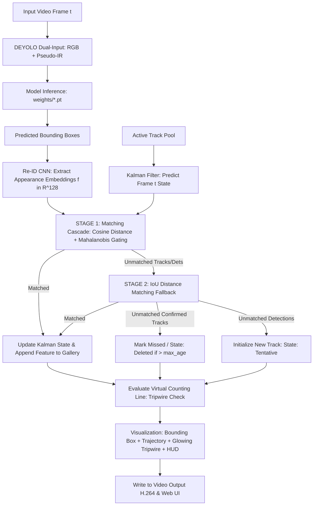
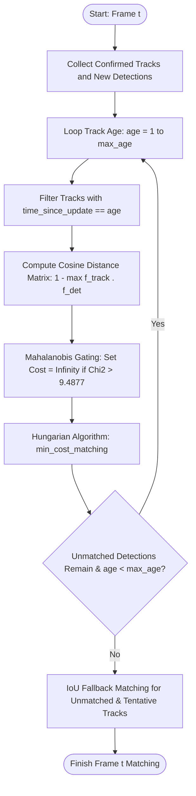

# 🚗 DeepSORT Multi-Object Tracking & Vehicle Counting (DEYOLO)

This module provides a standalone implementation of **DeepSORT** (*Simple Online and Realtime Tracking with a Deep Association Metric*, Wojke et al., ICIP 2017) integrated with **DEYOLO (Dual-Input Pseudo-IR)** and **YOLOv8**.

DeepSORT combines **Kalman Filter (Motion Information)** with **Deep Appearance Descriptors / Re-ID CNN (Visual Feature Embeddings)** for vehicle tracking robust against prolonged occlusions and severe rain conditions.

---

## 📑 Table of Contents
1. [Core Principles of DeepSORT](#1-core-principles-of-deepsort)
2. [DeepSORT Pipeline Architecture](#2-deepsort-pipeline-architecture)
3. [Matching Cascade Algorithm](#3-matching-cascade-algorithm)
4. [Mathematical Formulation](#4-mathematical-formulation)
5. [Virtual Counting Line (Tripwire)](#5-virtual-counting-line-tripwire)
6. [Directory Structure](#6-directory-structure)
7. [Usage Guide (Web UI & CLI)](#7-usage-guide)
8. [Comprehensive Comparison Matrix](#8-comprehensive-comparison-matrix)

---

## 1. Core Principles of DeepSORT

DeepSORT overcomes the limitations of purely geometric trackers (such as Euclidean distance trackers) via two fundamental mechanisms:

1. **Re-ID Feature Extractor (Visual Appearance Descriptor):**
   * Each vehicle bounding box crop is passed through a lightweight CNN to extract a 128-dimensional $L_2$-normalized feature vector ($||f||_2 = 1$).
   * A rolling appearance gallery stores past embeddings for each track. When an object is briefly occluded by wipers or passing vehicles, it is re-identified upon re-emergence via **Cosine Similarity**.
2. **Matching Cascade (Hierarchical Association):**
   * Prioritizes tracks with smaller age (recently observed objects) to reduce Kalman Filter covariance uncertainty.
3. **Mahalanobis Distance Gating:**
   * Statistically filters physically implausible detections using a $\chi^2$ (Chi-square distribution with 4 degrees of freedom at 95% confidence).

---

## 2. DeepSORT Pipeline Architecture



---

## 3. Matching Cascade Algorithm



---

## 4. Mathematical Formulation

### A. Cosine Distance Metric for Appearance Features
Given track $i$'s feature gallery $\mathcal{R}_i = \{f_1, f_2, \dots, f_K\}$ and candidate detection feature $f_j$:
$$d_{\text{visual}}(i, j) = 1 - \max_{f \in \mathcal{R}_i} \left( \frac{f^T f_j}{\|f\|_2 \|f_j\|_2} \right)$$
Because all embeddings are $L_2$-normalized ($\|f\|_2 = \|f_j\|_2 = 1$):
$$d_{\text{visual}}(i, j) = 1 - \max_{f \in \mathcal{R}_i} (f^T f_j)$$

### B. Mahalanobis Distance Gating
To verify whether observation $z_j$ lies within the kinematically plausible motion envelope of track $i$:
$$d_{\text{motion}}^2(i, j) = (z_j - \mathbf{H}\hat{\mathbf{x}}_i)^T \mathbf{S}_i^{-1} (z_j - \mathbf{H}\hat{\mathbf{x}}_i)$$
Detections are rejected if:
$$d_{\text{motion}}^2(i, j) > \chi^2_{0.95, 4} \approx 9.4877$$

---

## 5. Virtual Counting Line (Tripwire)

DeepSORT includes the `CountingLine` module to detect centroid crossings against a virtual horizontal tripwire $Y = Y_{\text{line}}$:
* **0% Duplicate Counting:** Unique track IDs are registered in `counted_ids` upon crossing.
* **Bidirectional Counting:** Separates incoming (*Down/In*) and outgoing (*Up/Out*) vehicle flow.

---

## 6. Directory Structure

```text
deepsort/
├── __init__.py               # Package initializer
├── feature_extractor.py       # Re-ID CNN (128-d L2-normalized appearance descriptor)
├── kalman_filter.py           # Kalman Filter with Chi-Square Mahalanobis Gating
├── tracker.py                 # DeepSORT Matching Cascade & Track lifecycle
├── deepsort_app.py            # Dedicated Streamlit Web UI
├── track_video_deepsort.py    # Standalone CLI runner
└── README.md                  # Scientific documentation
```

---

## 7. Usage Guide

### A. Web UI (Streamlit)
```bash
streamlit run deepsort/deepsort_app.py
```

### B. Command Line (CLI)
```bash
# Model DEYOLO (Dual-Input Pseudo-IR Sobel) + Counting Line at 55% frame height
python deepsort/track_video_deepsort.py --source "video.mp4" --weights weights/exp05_best.pt --line-y 0.55 --show

# Model DEYOLO (CLAHE + Sobel)
python deepsort/track_video_deepsort.py --source "video.mp4" --weights weights/exp07_best.pt --line-y 0.55 --show
```

---

## 8. Comprehensive Comparison Matrix

| Evaluation Criteria | Euclidean Distance Tracker | ByteTrack | DeepSORT |
| :--- | :---: | :---: | :---: |
| **Association Basis** | Spatial Centroid Distance | IoU Overlap + Score Partitioning | **Visual Re-ID Appearance + Motion** |
| **Motion Model** | None ($v=0$) | Kalman Filter 8-State | **Kalman Filter 8-State + Mahalanobis Gating** |
| **Long Occlusion Handling**| Severe ID Switching | Good (Frame Buffer) | **Superior (Visual Re-ID Gallery Recovery)** |
| **Deep Feature Extractor** | None | None | **CNN Appearance Descriptor (128-d)** |
| **Counting Mechanism** | New ID Registration | Virtual Tripwire Line | **Virtual Tripwire Line (0% Duplication)** |
| **Execution Speed** | ~60+ FPS | ~45–55 FPS | ~30–40 FPS |
| **Recommended Use Case**| Baseline comparison | High-speed traffic MOT | **Vehicles under long occlusion / Re-ID** |
