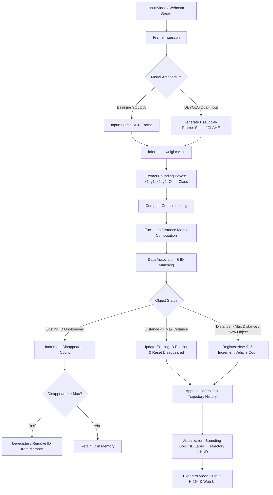

# 🚗 Euclidean Distance Tracker & Vehicle Counting (DEYOLO Baseline)

This directory contains the **Euclidean Distance Tracker** (Centroid Tracker) implementation integrated with **YOLOv8** and **DEYOLO (Dual-Input Pseudo-IR)** for vehicle detection and baseline tracking.

---

## 📑 Table of Contents
1. [System Pipeline Architecture](#1-system-pipeline-architecture)
2. [Tracking & Counting Flowchart](#2-tracking--counting-flowchart)
3. [Mathematical Formulation](#3-mathematical-formulation)
4. [Vehicle Counting Mechanism](#4-vehicle-counting-mechanism)
5. [Directory Structure](#5-directory-structure)
6. [Usage Guide (Web UI & CLI)](#6-usage-guide)
7. [Parameter Tuning & Limitations](#7-parameter-tuning--limitations)

---

## 1. System Pipeline Architecture



---

## 2. Tracking & Counting Flowchart

```mermaid
flowchart TD
    Start([Start: Frame t]) --> Read[Receive Detections: bboxes, classes, confs]
    Read --> CalcCentroid[Compute Centroids: cx = x1+x2/2, cy = y1+y2/2]
    
    CalcCentroid --> CheckDet{Number of New Detections == 0?}
    CheckDet -->|Yes| IncrAllDisp[Increment disappeared_count on ALL Existing IDs]
    IncrAllDisp --> CheckDeregAll{disappeared > max_disappeared?}
    CheckDeregAll -->|Yes| DeregAll[Remove ID from Tracker]
    CheckDeregAll -->|No| ReturnTracks[Return Active Tracks]
    DeregAll --> ReturnTracks
    
    CheckDet -->|No| CheckExisting{Number of Existing IDs == 0?}
    CheckExisting -->|Yes| RegAll[Register ALL Detections as New IDs]
    RegAll --> IncrCountAll[Total Count += Detections Count<br/>Update Class Counts]
    IncrCountAll --> ReturnTracks
    
    CheckExisting -->|No| BuildMatrix[Compute Euclidean Distance Matrix D[i, j]]
    BuildMatrix --> MatchGreedy[Sort pairs i, j by ascending distance]
    
    MatchGreedy --> CheckDist{Distance D[i, j] <= max_distance?}
    CheckDist -->|Yes| UpdateObj[1. Update Centroid & Bbox<br/>2. Reset disappeared = 0<br/>3. Append to Trajectory]
    CheckDist -->|No| UnmatchedNew[Mark Detection j as Unmatched]
    
    UpdateObj --> CheckUnmatchedRow{Unmatched Existing IDs?}
    UnmatchedNew --> CheckUnmatchedRow
    
    CheckUnmatchedRow -->|Yes| IncrDisp[Increment disappeared_count]
    IncrDisp --> CheckDereg{disappeared > max_disappeared?}
    CheckDereg -->|Yes| Dereg[Remove ID from Tracker]
    CheckDereg -->|No| CheckUnmatchedCol
    Dereg --> CheckUnmatchedCol
    CheckUnmatchedRow -->|No| CheckUnmatchedCol{Unmatched New Detections?}
    
    CheckUnmatchedCol -->|Yes| RegNew[1. Create New ID = next_id<br/>2. Total Unique Count += 1<br/>3. Class Count[class] += 1]
    CheckUnmatchedCol -->|No| ReturnTracks
    RegNew --> ReturnTracks
    
    ReturnTracks --> End([Finish Frame t])
```

---

## 3. Mathematical Formulation

### A. Centroid Extraction
$$c_x = \frac{x_1 + x_2}{2}, \quad c_y = \frac{y_1 + y_2}{2}$$

### B. Euclidean Distance
Between existing centroid $P_i = (c_{x,i}^{\text{old}}, c_{y,i}^{\text{old}})$ and new candidate $Q_j = (c_{x,j}^{\text{new}}, c_{y,j}^{\text{new}})$:
$$d(P_i, Q_j) = \sqrt{(c_{x,j}^{\text{new}} - c_{x,i}^{\text{old}})^2 + (c_{y,j}^{\text{new}} - c_{y,i}^{\text{old}})^2}$$

### C. Distance Matrix
$$\mathbf{D} = \begin{bmatrix}
d(P_1, Q_1) & d(P_1, Q_2) & \cdots & d(P_1, Q_M) \\
d(P_2, Q_1) & d(P_2, Q_2) & \cdots & d(P_2, Q_M) \\
\vdots & \vdots & \ddots & \vdots \\
d(P_N, Q_1) & d(P_N, Q_2) & \cdots & d(P_N, Q_M)
\end{bmatrix} \in \mathbb{R}^{N \times M}$$

---

## 4. Directory Structure

```text
tracking/
├── __init__.py               # Package initializer
├── euclidean_tracker.py      # Core EuclideanDistTracker class
├── tracker_app.py            # Dedicated Streamlit Web App
├── track_video.py            # Standalone CLI runner
└── README.md                 # Documentation
```

---

## 5. Usage Guide

### A. Web UI (Streamlit)
```bash
streamlit run tracking/tracker_app.py
```

### B. Command Line (CLI)
```bash
python tracking/track_video.py --source "video.mp4" --weights weights/exp05_best.pt --show
```
